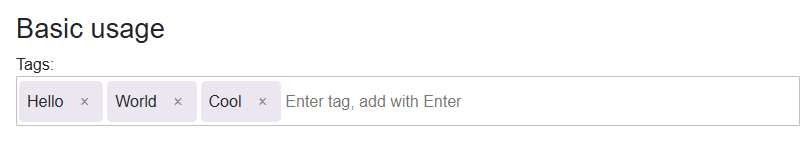

# BlazorInputTags
A simple to use blazor component for both Blazor Server and WebAssembly which adds a basic tag editor to your app.

See a live [demo](https://marvinklein1508.github.io/BlazorInputTags/) right here on github.



## Installation
You can install from Nuget using the following command:

Install-Package BlazorInputTags

Or via the Visual Studio package manger.

## Basic usage
Start by adding the using statement to your `_Imports.razor`

```csharp
@using BlazorInputTags
```

You can either use an existing `List<string>` and provide it to the component 
```csharp
<InputTags Value="Tags" />

@code {
	public List<string> Tags { get; set; } = new();
}
```

Or you can do manage the list by yourself.

```
<InputTags OnTagAdded="OnTagAddedAsync" OnTagRemoved="OnTagRemovedAsync"/>

@code {
	private Task OnTagAddedAsync(string tag) {
		// Do something with the tag
		return Task.CompletedTask;
	}

	private Task OnTagRemovedAsync(string tag) {
		// Do something with the tag
		return Task.CompletedTask;
	}
}
```

## Providing options
You can pass an `InputTagOptions` instance to the component to override some core logic and behaviour.

|Option|Type|Default|Description
|------|----|-------|-----------|
|WrapperClass|string|blazor-tag-wrapper|Sets the CSS class name for the tag wrapper
|TagListClass|string|blazor-tag-list|Sets the CSS class name for the tag list|
|TagClass|string|blazor-tag|Sets the CSS class name for the tag|
|InputClass|string|blazor-tag-input|Sets the CSS class name for the input field|
|LabelClass|string|blazor-tag-label|Sets the CSS class name for the label|
|RemoveButtonTooltip|string|Remove|Sets the text for delete tooltip button|
|InputPlaceholder|string|Enter tag, add with Enter|Sets the placeholder text for the input field|
|DisplayLabel|bool|true|Enabling the label of the component|
|MinLength|int|0|Sets the minimum length for a tag. 0 = no minimum|
|MaxLength|int|0|Sets the maximum length for a tag. 0 = no maximum|
|ValidateTag|Func<string, Task<bool>>?|null|Define a custom function to validate the tag before it's being added to the list.|

**Note: When changing the class names to something different, you'll need to add the CSS by yourself.** 

## Customizing design
The component uses custom CSS variables which can be overwritten within any public CSS file.

|Variable|Affects|
|--------|-------|
|--blazor-tag-wrapper-background-color|.blazor-tag-wrapper|
|--blazor-tag-wrapper-border-radius|.blazor-tag-wrapper|
|--blazor-tag-wrapper-border|.blazor-tag-wrapper|
|--blazor-tag-background-color|.blazor-tag|
|--blazor-tag-padding|.blazor-tag|
|--blazor-tag-margin|.blazor-tag|
|--blazor-tag-border-radius|.blazor-tag|
|--blazor-tag-button-color|.blazor-tag button|
|--blazor-tag-button-hover-background-color|.blazor-tag button:hover|
|--blazor-tag-button-hover-color|.blazor-tag button:hover|
|--blazor-tag-button-focus-border-color|.blazor-tag button:focus|

In addition you can overwrite or add any CSS using the corresponding selectors.


