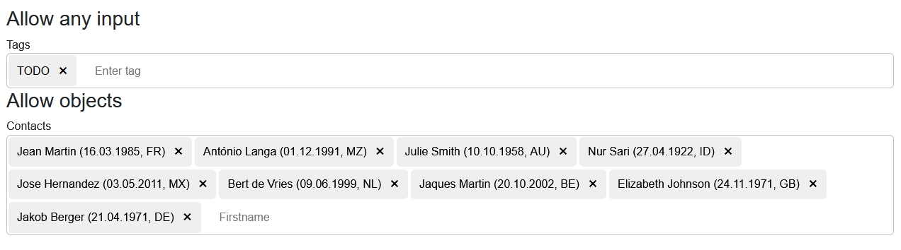

# BlazorInputTags
A simple to use blazor component for both Blazor Server and WebAssembly which adds a basic tag editor to your app.

See a live [demo](https://marvinklein1508.github.io/BlazorInputTags/) right here on github.



## Installation
You can install from Nuget using the following command:

Install-Package BlazorInputTags

Or via the Visual Studio package manger.

## Basic usage
Start by adding the using statement to your `_Imports.razor`

```razor
@using BlazorInputTags
```

You can provide any `List<T>` to the component like this
```razor
<InputTags TValue="Person" Value="PersonItems" OnOptionsSearch="OnSearchPeopleAsync" />

@code {
	public List<Person> PersonItems { get; set; } = [];

    private Task OnSearchPeopleAsync(OptionsSearchEventArgs<Person> e)
    {
        e.Items = DataSource.People.Where(p => p.FirstName.Contains(e.Text, StringComparison.OrdinalIgnoreCase));
        return Task.CompletedTask;
    }
}
```

`OnOptionsSearch` is an event that is triggered when the user types in the input field. You can use this event to provide a list of options to the user. The event is triggered with an `OptionsSearchEventArgs<T>` object which contains the search text and a list of items. You can set the items to the list of items you want to display to the user.

## Parameters
The following parameters are available for the component:

|Option|Type|Default|Description
|------|----|-------|-----------|
|Placeholder|`string`|string.Empty|Some text which will be displayed within the input field
|Label|`string?`|null|Text which should be displayed as label above the component|
|Value|`List<T>`|[]|The list of items which you want to bind to the component|
|OnOptionsSearch|`EventCallback<OptionsSearchEventArgs<TValue>>`|default|Callback to provide search results when the user is typing|
|ItemTemplate|`RenderFragment<TValue>?`|null|Provide custom rendering to display items within the component and search|


## Customizing design
The component uses custom CSS variables which can be overwritten within any public CSS file.

|Variable|Default value|
|--------|-------|
|--blazor-tag-input-wrapper-background-color|transparent|
|--blazor-tag-input-wrapper-border|1px solid silver|
|--blazor-tag-input-wrapper-border-radius|0.375rem|
|--blazor-tag-item-background-color|#efefef|
|--blazor-tag-item-padding|0 .75rem|
|--blazor-tag-item-margin|.125em|
|--blazor-tag-item-border-radius|var(--blazor-tag-input-wrapper-border-radius)|
|--blazor-tag-item-color|#000|
|--blazor-tag-item-button-border-radius|var(--blazor-tag-input-wrapper-border-radius)|
|--blazor-tag-item-button-focus-border-color|#4b4b4b|
|--blazor-tag-input-padding|.375rem .75rem|
|--blazor-tag-input-border-radius|var(--blazor-tag-input-wrapper-border-radius)|
|--blazor-tag-results-background-color|#fff|
|--blazor-tag-results-padding|.25rem|
|--blazor-tag-results-border|1px solid silver|
|--blazor-tag-results-border-radius|var(--blazor-tag-input-wrapper-border-radius)|
|--blazor-tag-results-item-border-radius|var(--blazor-tag-input-wrapper-border-radius)|
|--blazor-tag-results-item-hover-background-color|#efefef|

In addition you can overwrite or add any CSS using the corresponding selectors.


